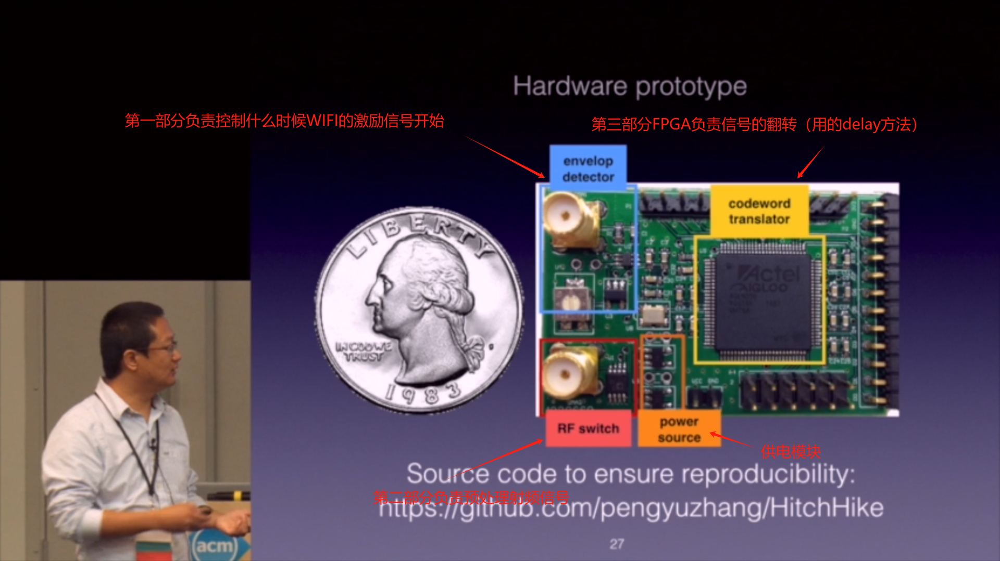

# HitchHike: Practical Backscatter Using Commodity WiFi

Pengyu Zhang 1, Dinesh Bharadia 2, Kiran Joshi 1, Sachin Katti 1
## [论文&&会议链接](https://dl.acm.org/doi/abs/10.1145/2994551.2994565)

# 论文分析

## 1. INTRODUCTION

贡献：

给出了商用WiFi间反向散射的系统部署，并有3个贡献：

(1) 通过WiFi设备直接产生sin信号波而无需布置其他有源设备

(2) 将编码的本质解释为信号翻转180°，通过tag来控制01编码而无需编码表。

(3) 通过split模块产生两个波，通过delay技术减少硬件翻转的功耗，使其相互抵消，实现高效的频域切换

## 2、802.11B PRIMER

- 仅仅需要翻转180°就可以实现两个codeword的转化
- 1Mbps需要2位，2Mbps需要4位实现，类推是通过e的阶乘来实现的,通过改变角度即可
- 通过tag来实现codeword的转化

## 3、 DESIGN

系统整体架构：

左边的发射一个802.11b信号，反向散射标签收到，处理为802.11b信号，再重新传给接收端

核心技术有三个：

802.11b codeword translator

XOR decoder

spectrally ecfficient frequency shifter

### 3.1 802.11b codeword translator

backscatter充当一个翻译官，将一个编码的802.11bcodewords编码为另一个codewords根据802.11b的codebook，然后接收端就可以接收到这个标准的802.11b正确解码

0，1可以互相转化

转化逻辑仅为简单的翻转180°

### 3.2 HitchHike’s XOR decoder

意思是在传输过程中会造成一次180度翻转，因此要是tag为1，则再造成一次翻转就会传输原数据，要是为0就不会翻转，因此传输的是相反的数据

因此仅需要将要传的原始数据和backscatter的tag位进行异或，即可得到发给接收端解码包的数据了
$$
decoded~packet=original~ data\oplus backscatter~bits\quad
$$
缺点：仅能发送1Mbps的包（因为2Mbps的包编码不是0，1，而是两位2进制数（00，01，10，11），需要四位来实现，而不是通过异或门的逻辑（那是不是可以按位异或实现呢？用门电路？将全高Mbps的全部转化为1Mbps的呢？））

### 3.3 spectrally ecfficient frequency shifter

问题来源：802.11b发射器自身所产生的干扰（因为他们的频域是相同的），如图所示

而且干扰信号较反向散射而言更大，通过反向散射，标签将反向散射信号频移到相邻的、不重叠的wifi信道来避免自干扰。但是并非不相邻的信道就没有干扰，产生了左右两边均有信号

解决方案为与一个方波信号相乘，就可以产生频谱的搬移，实验选取了30MHz来实现

### 3.4 Producing single side-band backscatter

频谱变化后出现的问题是左右两边均会有信号，因此tag产生了双端信号，而目标是仅产生一个红色信号

通过数学推导，±cos处均会产生信号，因此为双端信号

解决方案如图所示

逻辑为在左右两个方向上进行复制一个副本，左边做一个翻转（negative），右边保持不变，如下图

而On-Off keying中加入延迟机制，那么就保证了翻转（同时给出了数学推导）

### 3.5 Putting everything together

需要注意的是，反向散射的数据流不能破坏802.11b数据的前导码。否则，将会解码失败。而802.11b的一个头部为384bits，而我们使用的为1Mbps，因此需要384μs来保证头部传输完成，因此我们等待400μ秒

## 4. IMPLEMENTATION

### 4.1 802.11b transceiver and tag hardware

802.11b transceiver 

接收端：MacBook Pro笔记本

发射端：Inter NCU

tag 

电路图：

使用30MHz时钟，通过振荡器实现，产生信号一个直接输入给多路复用器，一个产生逆变（需要进行一次180°翻转）后输入

FPGA选则，若是转0（即tag=0）原值输出，使用0°的，反之使用180°翻转后的

随后分为两部分分别产生单端信号，一端不变，另一端翻转90°（延迟实现，30MHz，对应33.3ns，而翻转90°对应1/4时钟长度，为8.3ns）

随后两个单端信号结合，可以消除两端信号，而只保留单端信号

### 4.2 How to synchronize with 802.11b packets?

通过能量监视器来实现同步

时延越高，崩溃的数据量就越大，但是只要同步时间小于2μs，就不会产生反向散射编码的影响

## 5. EVALUATION

效果：

- 视线场景 50m，非视线场景（两堵墙）16m
- 在34米远有300Kbps吞吐，再远有平均222kbps，非视线场景平均50kbps
- 反向散射在距离发射端6m处仍能正确编码
- 功耗仅为33μW，同时与现有WiFi进行协调测试工作良好

### 5.1 HitchHike’s Performance

从三个维度进行说明

throughput, bit error rate(BER), and received signal strength indicator (RSSI).

吞吐量，误码率，接收信号强度

布置方式：

#### 5.1.1 Line-of-sight performance

最大距离 54m，在34米处仍有接近300Kbps吞吐，适合可穿戴设备

在40m远处，信号强度低于-80dBm且编码困难

在长距离时，误码率增大10倍（0.01到0.1），吞吐量减少

#### 5.1.2 Non-line-of-sight Performance

分析同视线场景，不做赘述

#### 5.1.3 Impact of WiFi Transmitter Power

从图14可以看出15dBm与30dBM的对比，30dBm性能显然更好，距离远且误码率低

#### 5.1.4 Impact of Transmitter-Tag Distance

可以离接收端远一点，但是不能离发射端较远，不能识别到激励包，再远都不行

理论能达到距离发射端50m的最大距离，但是实际只能达到6m，相差较大

#### 5.1.5 Impact of Synchronization Signal Delay

可以看出，不同延迟基本上没太大影响

#### 5.1.6 Impact of Packet Checksum

受设备影响，部分机器不支持校验和，但是MacBook Pro支持

### 5.2 Tag Power Consumption

总计33μW，为低功率设备，可以无电池部署

### 5.3 Co-existence with WiFi Networks

与多种频率的WiFi进行部署观察结果

#### 5.3.1 How does backscatter impact WiFi?

反向散射不易对WiFi流产生影响

#### 5.3.2 How does WiFi impact backscatter?

因为频域不同，因此影响也很小（一个60MHz，一个2.4GHz）

## 6. RELATED WORK

是第一个不通过标准化硬件仅通过商业化WiFi硬件即可进行反向散射的系统

## 7. CONCLUSION

是第一个可以完全使用商用WiFi进行部署框架结构的反向散射系统，未来考虑在别的频率进行使用

## 8. ACKNOWLEDGEMENTS

## 9. REFERENCES

# 会议分析

###  核心问题：与别的设备比，WiFi的功率要大的多，那么如何解决这个问题是关键

### why

所有的三个部件都会产生很强的功耗，第一个部件产生信号，第二个混合，第三个处理信号，因此我们怎么做到低功耗？

### method

将三个部件转化为一个HitchHike模块这个模块可以将激发信号直接转化为WIFI信号

### Question

#### How to generation excitation signal

传统的方式为通过一个供电的设备产生sin信号，再有HitchHike处理转化为WIFI信号，输入给接收器

##### 存在问题：

设备需要供电

那么怎么不需要供电即可产生sin信号呢？

##### 解决方案

使用现有的802.11b的WiFi信号通过WiFi发射器生成WiFi包再通过HitchHike将已有的信号转化为WIFI信号进行传播

优点：

- 不用布置任何设备，仅使用现存的商业化的WIFI设备即可

### 技术核心

主要提出了两种创新技术：

- 码字翻译 - 以解决WIFI设备间的反向传输问题
- 单侧的反向散射技术 - 可以有效提升频谱的效率

### 前驱技术

#### How the WiFi worked

在802.11b中，01使用初始设定好的编码表去编码01代码

### 主要改进点1

仅仅使用取反即可将0（i）转换为1（j）

通过codebook即可实现

通过HitchHike

设置tag为0，则保持原值不变

设置tag为1，则输出相反值

#### Question here：这个转化如何低功率的实现？

##### 原理：

可以看到两个信号的本质区别在于信号仅仅翻转了180°，那么如何做到翻转的呢？

使用翻转器要500μ瓦的功率，而使用delay延迟仅需要1μ瓦

### 核心技术2

#### 现存问题

WiFi接收器会受到发射器的信号干扰，而这个信号要远比反射信号强的多

那么接收端收不到反射信号

收不到的本质是频域基本相同，而功率反射功率要低，因此收不到

那么解决方法就是频率的迁移即可

##### 前人研究

直接改变频域，使用时间主导的信号tag T乘输入信号S 得到B，B作为反向散射的频域，以此区分

但是这个存在的问题在于，

#### 解决方案

由于其他发射器的影响（可能？）同时会在左边同时形成（为啥形成？没懂）一个没有任何意义的，完全相同的频带，因此怎么解决是关键

这里采用了一个split模块，上半部分生成和backscatter完全相同的signal

但是下半部分左边生成了一个相反的signal，这样子上下可以抵消（怎么生成？相加右边不会加倍嘛？WIFI signal 不会发生增强嘛？）

### 解码信息

那么我们如何解码tag的信息呢？输出 = tag 异或 输入

那么

tag = 输入 异或 输出

（为啥要解码出tag啊？）

### 硬件实现

硬件实现主要由四个部分

第一个部分控制WiFi发射器什么时候发射信号，激励信号的开始

第二个部分负责预处理射频信号

第三部分为FPGA实现信号翻转

第四部分为供电模块

### 实验验证

#### 实验表现

 

直线部署下，15dBm大约可传42KM，30dbBm则更远

非直线部署大约可传32m

同时ECG信号（心电图信号？）亦可传输

### 总结

- 论文首次提出了反向散射系统可以对WIFI信号取反
- 单方向的频谱可以有效的将输入输出频谱划分
- 在100-300kbps信号下可以传播10-30m
- 现阶段在设计MAC层的HitchHike设备

